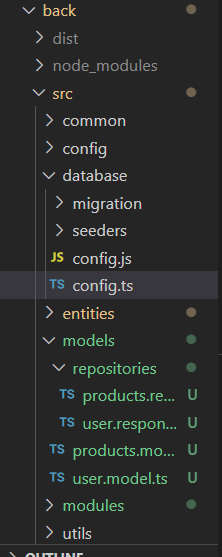
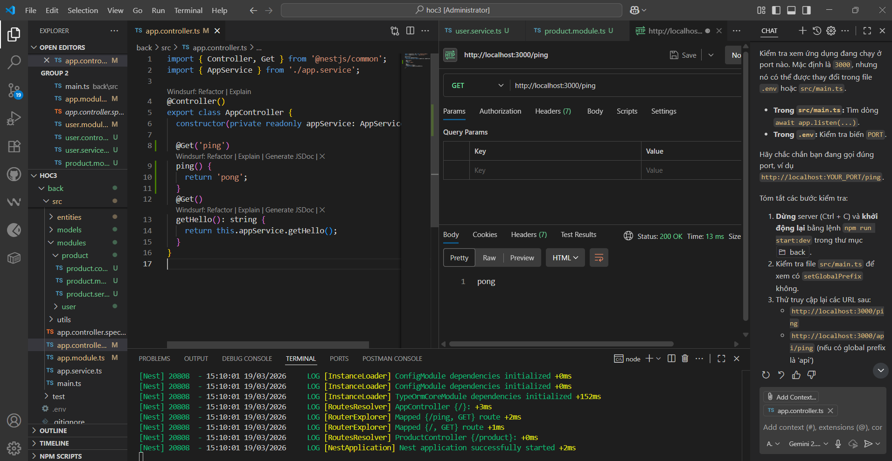
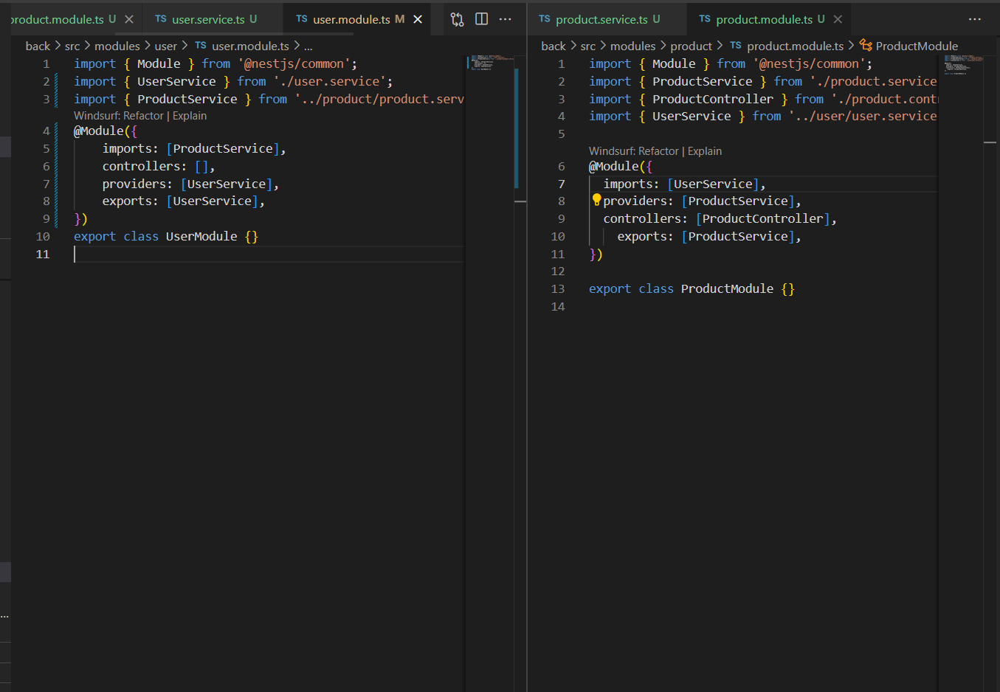
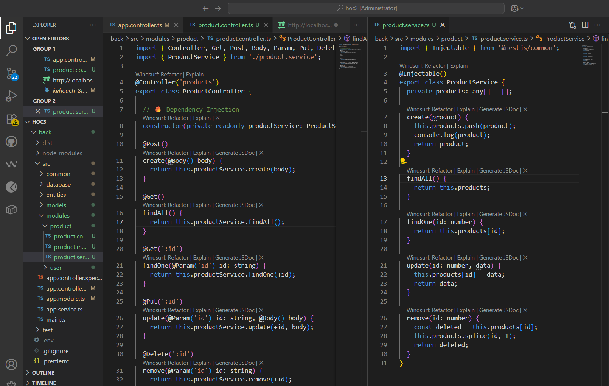

# Tổng kết Tuần 1

Dưới đây là những nội dung đã học được trong tuần đầu tiên, bao gồm các khái niệm cơ bản của NestJS và kết quả thực hành tương ứng.

## 1. Khởi tạo project & Cấu trúc thư mục chuẩn
- **Trạng thái:** Hoàn thành ✅
- **Ghi chú:** Sử dụng Nest CLI để khởi tạo project mới.
- **Kết quả:** Source code rỗng, được tổ chức theo cấu trúc chuẩn của NestJS.
- **Minh chứng:**
  

## 2. Học Controllers & Routing
- **Trạng thái:** Hoàn thành ✅
- **Nội dung:** Xây dựng endpoint `/ping` cơ bản để xử lý routing và trả về response.
- **Kết quả:** Gọi API `/ping` và nhận về text cơ bản để test qua công cụ Postman.
- **Minh chứng:**
  

## 3. Học Providers & Dependency Injection
- **Trạng thái:** Hoàn thành ✅
- **Ghi chú:** Tránh viết logic xử lý trực tiếp bên trong Controller.
- **Nội dung:** Tìm hiểu cách Inject provider vào Controller. Khởi tạo `ProductService` và inject trực tiếp vào `ProductController` để xử lý các tác vụ CRUD thông qua dữ liệu mảng ảo tĩnh.
- **Minh chứng:**
  

## 4. Học Modules
- **Trạng thái:** Hoàn thành ✅
- **Ghi chú:** Nắm vững tính đóng gói (encapsulation) trong framework.
- **Nội dung:** Tách biệt `UserModule` và `ProductModule`, tìm hiểu cơ chế *export service chéo* giữa các module với nhau một cách hợp lý.
- **Minh chứng:**
  
