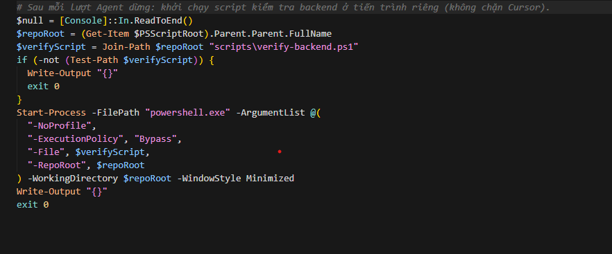

# Tổng kết Tuần 5 – Quản lý Ngữ cảnh & Tiêu chuẩn hóa với Agent Skills

Nội dung tuần 5 tập trung đóng gói quy tắc NestJS theo chuẩn Cursor Rules / Agent Skills, giảm tải prompt dài, và tự động hóa bước kiểm tra sau khi Agent hoàn thành một lượt.

## 1. Định nghĩa Bộ Kỹ năng (Agent Skills) cho Backend
- **Trạng thái:** Hoàn thành ✅
- **Ghi chú:** Dùng thư mục `.cursor/rules/` với các file `.mdc` (frontmatter `description`, `globs`, `alwaysApply`) để Cursor chỉ nạp đúng phần hướng dẫn khi làm việc với nhóm file tương ứng.
- **Kết quả:**
  - `nestjs-clean-architecture.mdc` — module/feature, Controller/Service/Entity/DTO, TypeORM, strict TS.
  - `nestjs-api-rest.mdc` — REST, versioning `/api/v1`, danh từ số nhiều, HTTP/Swagger.
  - `nestjs-unit-tests.mdc` — Jest, mock repository, lệnh chạy test.
  - `nestjs-code-review.mdc` — checklist review nhanh trước merge.
  - Skill dài `cursor/rules/SKILL.md` được bổ sung dòng hướng dẫn ưu tiên rule ngắn trước, mở skill đầy đủ khi cần template.
- **Minh chứng:**
  [Cursor rules tuần 5](/cursor/rules/SKILL.md)

## 2. Tối ưu hóa Token & Quản lý Context (Load on-demand)
- **Trạng thái:** Hoàn thành ✅
- **Ghi chú:** So sánh mang tính **ước lượng** (Cursor không công bố số token đọc rule theo từng request; có thể đối chiếu bằng độ dài văn bản ~ ký tự/4).
- **Kết quả:** Chia tách thay vì gộp một file quy tắc khổng lồ vào mọi phiên chat.

| Cách tiếp cận | Nội dung tham chiếu (xấp xỉ) | Ước lượng quy mô (dòng) | Khi nào được “gợi” nạp |
|---------------|-----------------------------|-------------------------|-------------------------|
| Gộp chung | `back/.cursorrules` + toàn bộ `cursor/rules/SKILL.md` | ~780+ dòng | Nếu copy toàn bộ vào prompt / luôn đính kèm |
| Chia nhỏ (tuần 5) | 4 file `.mdc` trong `.cursor/rules/` | ~120 dòng tổng | Theo `globs` (vd chỉ `*.controller.ts` hoặc `*.spec.ts`) |

**Nhận xét:** Với file controller, chỉ cần khớp `nestjs-clean-architecture` + `nestjs-api-rest` (hai file ngắn) thay vì toàn bộ skill + `.cursorrules`, giúp giảm nguy cơ tràn ngữ cảnh trên các model có giới hạn ngữ cảnh lớn nhưng vẫn bị nhiễu bởi template dài không liên quan.

- **Minh chứng:**
  [Mở thư mục `.cursor`](../../.cursor) (chứa rules/hooks đã cấu hình)

## 3. Đóng gói Workflow tự động hóa bằng Script
- **Trạng thái:** Hoàn thành ✅
- **Ghi chú:** Cursor Hook sự kiện `stop` gọi PowerShell; script kiểm tra chạy nền để không khóa IDE.
- **Kết quả:**
  - `scripts/verify-backend.ps1` (Windows) và `scripts/verify-backend.sh` (Linux/macOS): `docker compose up -d` tại root (nếu có `docker-compose.yml`), sau đó `npm run test` trong `back/`. Log ghi `scripts/verify-backend-last.log`.
  - `.cursor/hooks.json` + `.cursor/hooks/after-stop-verify.ps1`: sau mỗi lượt Agent dừng, tự khởi chạy script trên (có thể tắt bằng cách xóa hoặc đổi `hooks.json` nếu không muốn chạy nền).
- **Minh chứng:**
  
