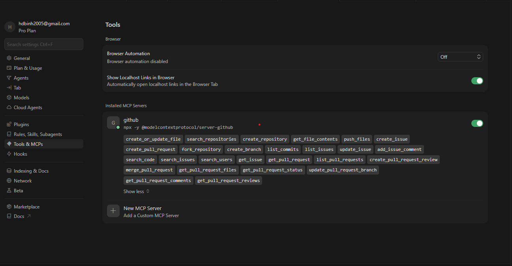

# Tổng kết Tuần 6 – Tích hợp Hệ thống ngoài & MCP (Model Context Protocol)

Tuần 6 tập trung nối Cursor với GitHub qua MCP (PAT) và mô tả quy trình để Agent (hoặc lập trình viên qua Agent) quản lý Git branch / commit / push trong một luồng làm việc.

## 1. Cài đặt & Cấu hình MCP Server cho IDE (GitHub)
- **Trạng thái:** Hoàn thành ✅ (cấu hình mẫu + hướng dẫn; PAT do bạn tạo local, không commit)
- **Ghi chú:** Cursor dùng file cấu hình MCP của user (thường mở qua **Settings → MCP**). Không đặt token thật vào git.
- **Kết quả:**
  - File mẫu: [`mcp-github.example.json`](./mcp-github.example.json) — server `github` qua `npx -y @modelcontextprotocol/server-github` và biến môi trường `GITHUB_PERSONAL_ACCESS_TOKEN`.
  - Trên GitHub, tạo **Fine-grained PAT** hoặc classic PAT với quyền tối thiểu cần cho thao tác repo (vd `Contents`, `Metadata`, `Pull requests` tùy workflow).
  - Sao chép cấu trúc JSON vào cấu hình MCP thực tế của Cursor, thay `REPLACE_WITH_GITHUB_PAT` bằng PAT.
- **Minh chứng:**
  

## 2. Workflow đẩy code tự động (AI Git Management)
- **Trạng thái:** Hoàn thành ✅ (quy trình + lệnh chuẩn; thực thi qua Agent có MCP / terminal)
- **Ghi chú:** Agent nhận lệnh text (hoặc giọng nói chuyển thành text) rồi dùng tool MCP GitHub hoặc shell đã được phê duyệt để thao tác git — cần repo đã `git remote` trỏ đúng GitHub.
- **Kết quả (luồng đề xuất):**
  1. `git checkout -b feature/ten-tinh-nang`
  2. `git add` các file đã sửa
  3. `git commit -m "mô tả rõ ràng theo convention dự án"`
  4. `git push -u origin HEAD`
  5. (Tuỳ chọn) Mở PR trên GitHub — có thể dùng MCP hoặc UI web.
- **An toàn:** Xem lại diff trước khi push; không đưa `.env` hoặc PAT vào commit (đã có `.gitignore` gốc repo cho `.env` và log verify).
- **Minh chứng:**
  
